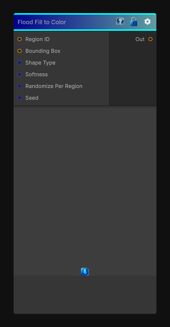

# Flood Fill to Color

> This file is auto-generated by `Documentation/Generate-GenesisNodeDocs.ps1`.

[Back to index](../../README.md) | [Back to Effects](../../effects.md)

## Snapshot

## Details

- Menu: `Effects/Flood Fill To Shape`
- Node group: `Effects`
- Shader: `Hidden/Genesis/FloodFillToShape`
- Source: [Runtime/Nodes/Effects/Effects/FloodFillToShapeNode.cs](../../../../Runtime/Nodes/Effects/Effects/FloodFillToShapeNode.cs)

## Documentation

In Genesis, this is used for:
- Stylized shape masks
- Region-aware patterning
- Procedural tile shapes
- Shape-driven gradients
- Region-based stylization
To replicate this in Genesis CRT, we combine:
- Region ID
- Bounding Box (normalized UV inside region)
- A shape function (circle, diamond, square, etc.)
- Optional per-region randomization
