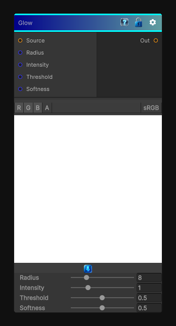

# Glow

> This file is auto-generated by `Documentation/Generate-GenesisNodeDocs.ps1`.

[Back to index](../../README.md) | [Back to Effects](../../effects.md)

## Snapshot

## Details

- Menu: `Effects/Glow`
- Node group: `Effects`
- Shader: `Hidden/Genesis/Glow`
- Source: [Runtime/Nodes/Effects/Effects/GlowNode.cs](../../../../Runtime/Nodes/Effects/Effects/GlowNode.cs)

## Documentation

It's a procedural halo generator that creates:
- A soft radial glow around bright areas
- With falloff shaping
- Intensity and radius control
- Thresholding so only bright pixels glow
- Fully grayscale-friendly
