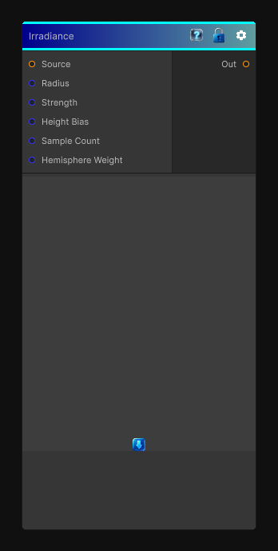

# Irradiance

> This file is auto-generated by `Documentation/Generate-GenesisNodeDocs.ps1`.

[Back to index](../../README.md) | [Back to Effects](../../effects.md)

## Snapshot

## Details

- Menu: `Effects/Irradiance`
- Node group: `Effects`
- Shader: `Hidden/Genesis/RTIrradiance`
- Source: [Runtime/Nodes/Effects/Effects/IrradianceNode.cs](../../../../Runtime/Nodes/Effects/Effects/IrradianceNode.cs)

## Documentation

Essentially a real-time hemispherical light integration node. It computes a soft, view-independent irradiance term by:
- 	Sampling the source height/albedo
- 	Integrating light from multiple directions
- 	Using a hemisphere kernel
- 	Producing a soft ambient occlusion-like irradiance map
It's not SSAO, not blur, not curvature - it's a multi-directional, weighted gather that simulates diffuse light accumulation.
