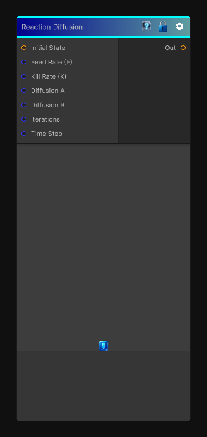

# Reaction Diffusion

> This file is auto-generated by `Documentation/Generate-GenesisNodeDocs.ps1`.

[Back to index](../../README.md) | [Back to Effects](../../effects.md)

## Snapshot

## Details

- Menu: `Effects/Reaction Diffusion`
- Node group: `Effects`
- Shader: `Hidden/Genesis/ReactionDiffusion`
- Source: [Runtime/Nodes/Effects/Effects/ReactionDiffusionNode.cs](../../../../Runtime/Nodes/Effects/Effects/ReactionDiffusionNode.cs)

## Documentation

discrete reaction-diffusion solver:
- Two fields: A (activator) and B (inhibitor)
- A diffuses slowly, B diffuses faster
- They react according to the Gray-Scott equations
- After a number of iterations, you get:
- Spots
- Stripes
- Labyrinths
- Turing patterns
