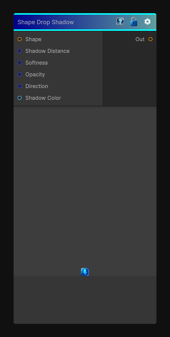

# Shape Drop Shadow

> This file is auto-generated by `Documentation/Generate-GenesisNodeDocs.ps1`.

[Back to index](../../README.md) | [Back to Effects](../../effects.md)

## Snapshot

## Details

- Menu: `Effects/Shape Drop Shadow`
- Node group: `Effects`
- Shader: `Hidden/Genesis/ShapeDropShadow`
- Source: [Runtime/Nodes/Effects/Effects/ShapeDropShadowNode.cs](../../../../Runtime/Nodes/Effects/Effects/ShapeDropShadowNode.cs)

## Documentation

Shape Drop Shadow - the one that takes a shape mask and produces a soft, directional, distance-based shadow with:
- Direction
- Distance
- Softness
- Opacity
- Color
- Height-aware falloff (optional in Substance)
This is not a blur, not a bevel - it's a ray-marched shadow cast from a binary shape
