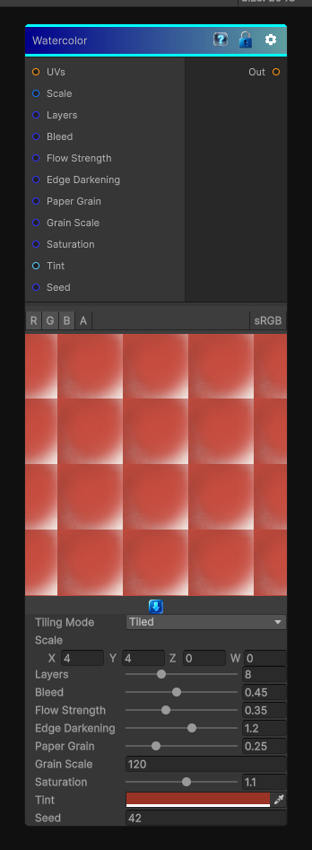

# Watercolor

> This file is auto-generated by `Documentation/Generate-GenesisNodeDocs.ps1`.

[Back to index](../../README.md) | [Back to Effects](../../effects.md)

## Snapshot

## Details

- Menu: `Effects/Watercolor`
- Node group: `Effects`
- Shader: `Hidden/Genesis/Watercolor`
- Source: [Runtime/Nodes/Effects/Effects/WatercolorNode.cs](../../../../Runtime/Nodes/Effects/Effects/WatercolorNode.cs)

## Documentation

Scale controls blotch size. Use larger X/Y to stretch blotches.
Layers increases richness and overlap; higher values are slower.
Bleed softens blotch edges and increases watercolor diffusion.
Flow creates directional streaking; combine with nonzero _Scale X/Y differences for directional brush effects.
EdgeDark strengthens wet edges and pigment pooling.
PaperGrain and GrainScale add realistic paper texture and granulation.
