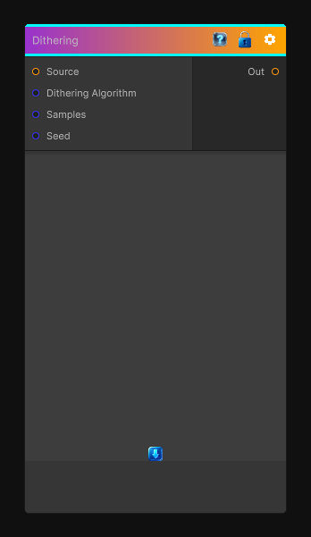

# Dithering

> This file is auto-generated by `Documentation/Generate-GenesisNodeDocs.ps1`.

[Back to index](../../README.md) | [Back to Filters](../../filters.md)

## Snapshot

## Details

- Menu: `Filters/Blur/Dithering`
- Node group: `Blur`
- Shader: `Hidden/Genesis/Dither`
- Source: [Runtime/Nodes/Filters/Blur/DitherNode.cs](../../../../Runtime/Nodes/Filters/Blur/DitherNode.cs)

## Documentation

Dithering with an algorithm selection:
Equidistant Sampling
2x2 Ordered dithering offsets
2 step random dithering offsets
Random offset per pixel
