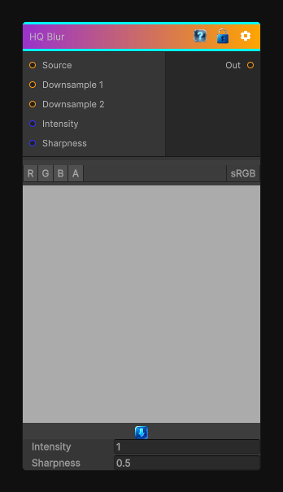

# HQ Blur

> This file is auto-generated by `Documentation/Generate-GenesisNodeDocs.ps1`.

[Back to index](../../README.md) | [Back to Filters](../../filters.md)

## Snapshot

## Details

- Menu: `Filters/Blur/HQ Blur`
- Node group: `Blur`
- Shader: `Hidden/Genesis/BlurHQ`
- Source: [Runtime/Nodes/Filters/Blur/HQBlurNode.cs](../../../../Runtime/Nodes/Filters/Blur/HQBlurNode.cs)

## Documentation

High quality blur
Downsample -> blur -> upsample -> blend

Produces large-radius, smooth, artifact-free blur

Matches Substance's Blur HQ behavior

Works for grayscale and color
