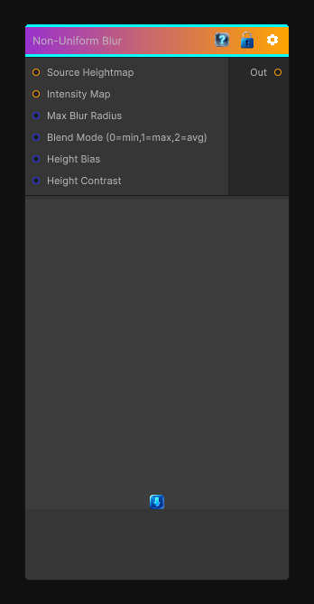

# Non-Uniform Blur

> This file is auto-generated by `Documentation/Generate-GenesisNodeDocs.ps1`.

[Back to index](../../README.md) | [Back to Filters](../../filters.md)

## Snapshot

## Details

- Menu: `Filters/Blur/Non-Uniform Blur`
- Node group: `Blur`
- Shader: `Hidden/Genesis/NonUniformBlur`
- Source: [Runtime/Nodes/Filters/Blur/NonUniformBlurNode.cs](../../../../Runtime/Nodes/Filters/Blur/NonUniformBlurNode.cs)

## Documentation

Non-Uniform blur where blur radius is determined by the intensity map
