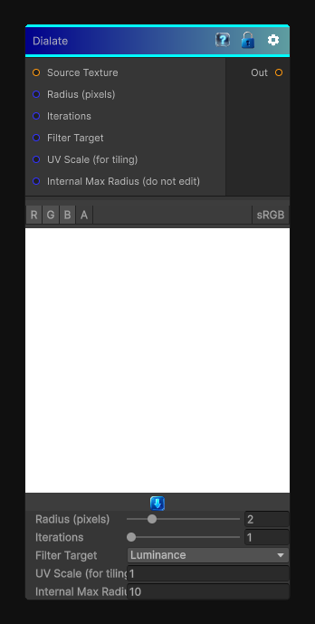

# Dialate

> This file is auto-generated by `Documentation/Generate-GenesisNodeDocs.ps1`.

[Back to index](../../README.md) | [Back to Filters](../../filters.md)

## Snapshot

## Details

- Menu: `Filters/Dialate`
- Node group: `Effects`
- Shader: `Hidden/Genesis/DilationFilter`
- Source: [Runtime/Nodes/Filters/DialateNode.cs](../../../../Runtime/Nodes/Filters/DialateNode.cs)

## Documentation

performs morphological dilation on a feature mask derived from the source texture. It supports binary dilation (thresholded luminance) and grayscale dilation (max filter on luminance), iterative dilation (multiple passes), and a simple color expansion strategy that expands feature colors into the dilated region
