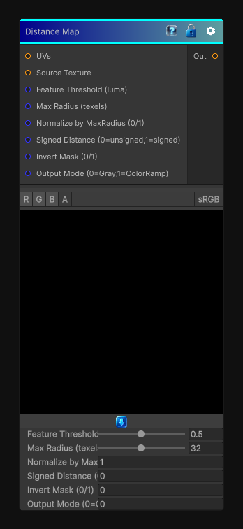

# Distance Map

> This file is auto-generated by `Documentation/Generate-GenesisNodeDocs.ps1`.

[Back to index](../../README.md) | [Back to Filters](../../filters.md)

## Snapshot

## Details

- Menu: `Filters/Distance Map`
- Node group: `Effects`
- Shader: `Hidden/Genesis/DistanceMap`
- Source: [Runtime/Nodes/Filters/DistanceMapNode.cs](../../../../Runtime/Nodes/Filters/DistanceMapNode.cs)

## Documentation

computes an approximate distance map from a binary feature mask derived from the source texture. It scans a circular neighborhood up to _MaxRadius texels and returns the minimum Euclidean distance to the nearest feature pixel. Options let you output normalized distance, pixel distance, or a signed distance (inside/outside).
