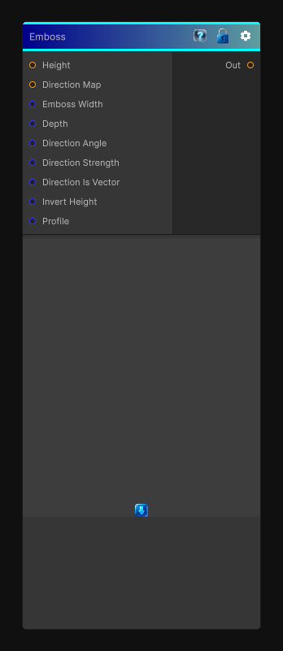

# Emboss

> This file is auto-generated by `Documentation/Generate-GenesisNodeDocs.ps1`.

[Back to index](../../README.md) | [Back to Filters](../../filters.md)

## Snapshot

## Details

- Menu: `Filters/Distort/Emboss`
- Node group: `Effects`
- Shader: `Hidden/Genesis/Emboss`
- Source: [Runtime/Nodes/Filters/Distort/EmbossNode.cs](../../../../Runtime/Nodes/Filters/Distort/EmbossNode.cs)

## Documentation

- 	A height-based normal offset
- 	Applied in a user-defined direction
- 	With positive/negative embossing
- 	And a soft profile that blends between bump-map-like and relief-map-like shading
