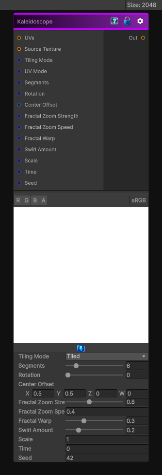

# Kaleidoscope

> This file is auto-generated by `Documentation/Generate-GenesisNodeDocs.ps1`.

[Back to index](../../README.md) | [Back to Filters](../../filters.md)

## Snapshot

## Details

- Menu: `Filters/Distort/Kaleidoscope`
- Node group: `Operations`
- Shader: `Hidden/Genesis/Kaleidoscope`
- Source: [Runtime/Nodes/Filters/Distort/KaleidoscopeNode.cs](../../../../Runtime/Nodes/Filters/Distort/KaleidoscopeNode.cs)

## Documentation

- Performs angular kaleidoscope folding
- Applies radial fractal zooming (Mandelbrot-style smooth zoom)
- Supports 2D / 3D / Cube UV modes
- Has rotation, zoom speed, swirl, center offset, segment count, and fractal warp
- Works with any input texture (or procedural source upstream)
