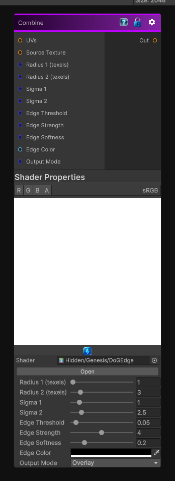

# Combine

> This file is auto-generated by `Documentation/Generate-GenesisNodeDocs.ps1`.

[Back to index](../../README.md) | [Back to Filters](../../filters.md)

## Snapshot

## Details

- Menu: `Filters/Edge Detect/Difference of Gaussians`
- Node group: `Operations`
- Shader: `Hidden/Genesis/DoGEdge`
- Source: [Runtime/Nodes/Filters/Edge Detect/DifferenceOfGaussiansNode.cs](../../../../Runtime/Nodes/Filters/Edge Detect/DifferenceOfGaussiansNode.cs)

## Documentation

computes a Difference of Gaussians (DoG) edge response. It performs two small separable Gaussian-like blurs at different radii, subtracts them to produce band-pass edges, applies thresholding and optional softening, and can output an edge mask, overlay edges on the source, or show edges only.
