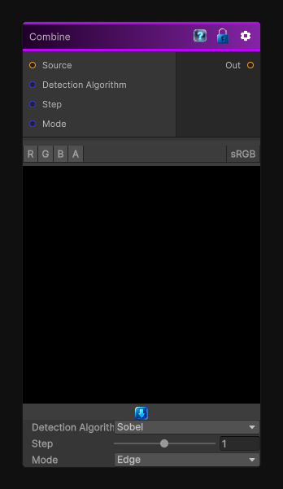

# Combine

> This file is auto-generated by `Documentation/Generate-GenesisNodeDocs.ps1`.

[Back to index](../../README.md) | [Back to Filters](../../filters.md)

## Snapshot

## Details

- Menu: `Filters/Edge Detect/Edge Detection`
- Node group: `Operations`
- Shader: `Hidden/Genesis/EdgeDetection`
- Source: [Runtime/Nodes/Filters/Edge Detect/EdgeDetectionNode.cs](../../../../Runtime/Nodes/Filters/Edge Detect/EdgeDetectionNode.cs)

## Documentation

Edge detection using one of a few different algorithms
