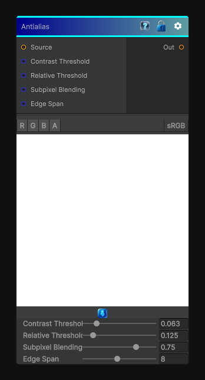

# Antialias

> This file is auto-generated by `Documentation/Generate-GenesisNodeDocs.ps1`.

[Back to index](../../README.md) | [Back to Filters](../../filters.md)

## Snapshot

## Details

- Menu: `Filters/Enhance/Antialias`
- Node group: `Effects`
- Shader: `Hidden/Genesis/FXAA`
- Source: [Runtime/Nodes/Filters/Enhance/AntialiasNode.cs](../../../../Runtime/Nodes/Filters/Enhance/AntialiasNode.cs)

## Documentation

FXAA-style antialiasing for generated textures.
- Input: source color
- Output: smoothed color with preserved detail
- Works on 2D textures, 3D slices, and cube faces
- Tunable thresholds, span, and subpixel blending
