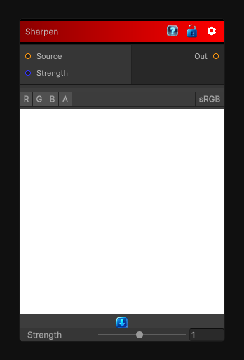

# Sharpen

> This file is auto-generated by `Documentation/Generate-GenesisNodeDocs.ps1`.

[Back to index](../../README.md) | [Back to Filters](../../filters.md)

## Snapshot

## Details

- Menu: `Filters/Enhance/Sharpen`
- Shader: `Hidden/Genesis/Sharpen`
- Source: [Runtime/Nodes/Filters/Enhance/SharpenNode.cs](../../../../Runtime/Nodes/Filters/Enhance/SharpenNode.cs)

## Documentation

Sharpen the input image using a very simple 3x3 sharpening kernel.
