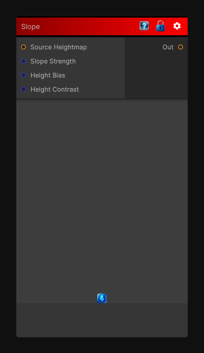

# Slope

> This file is auto-generated by `Documentation/Generate-GenesisNodeDocs.ps1`.

[Back to index](../../README.md) | [Back to Filters](../../filters.md)

## Snapshot

## Details

- Menu: `Filters/Slope`
- Shader: `Hidden/Genesis/Slope`
- Source: [Runtime/Nodes/Filters/SlopeNode.cs](../../../../Runtime/Nodes/Filters/SlopeNode.cs)

## Documentation

Calculate the slope of the input heightmap. The slope is calculated as the difference between the current pixel and its neighbors, giving you a measure of how steep the terrain is at that point. This can be used for various effects, such as erosion, texturing, or masking based on steepness.
