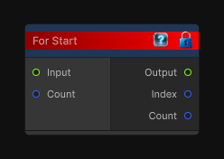

# For Start

> This file is auto-generated by `Documentation/Generate-GenesisNodeDocs.ps1`.

[Back to index](../../README.md) | [Back to Flow](../../flow.md)

## Snapshot

## Details

- Menu: `Flow/For Start`
- Source: [Runtime/Nodes/FlowControl/ForStart.cs](../../../../Runtime/Nodes/FlowControl/ForStart.cs)

## Documentation

Begins a for-loop flow block.
