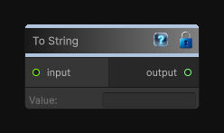

# To String

> This file is auto-generated by `Documentation/Generate-GenesisNodeDocs.ps1`.

[Back to index](../../README.md) | [Back to Function](../../function.md)

## Snapshot

## Details

- Menu: `Function/Cast/To String`
- Node group: `Cast`
- Source: [Runtime/Nodes/Functions/Cast/ToStringNode.cs](../../../../Runtime/Nodes/Functions/Cast/ToStringNode.cs)

## Documentation

Casts the input value to String.
