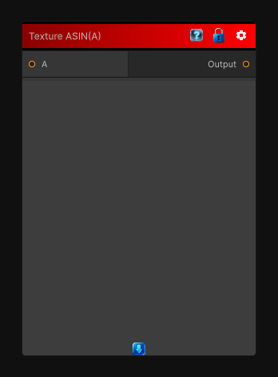

# Texture ASIN(A)

> This file is auto-generated by `Documentation/Generate-GenesisNodeDocs.ps1`.

[Back to index](../../README.md) | [Back to Function](../../function.md)

## Snapshot

## Details

- Menu: `Function/Texture/Texture ASIN(A)`
- Node group: `Texture`
- Source: [Runtime/Nodes/Functions/Textures/ASinTexture.cs](../../../../Runtime/Nodes/Functions/Textures/ASinTexture.cs)

## Documentation

Applies `ASIN(A)` to the source texture per pixel.
