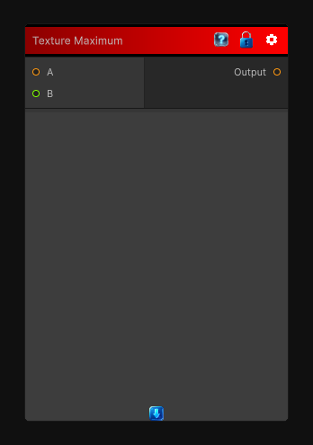

# Texture Maximum

> This file is auto-generated by `Documentation/Generate-GenesisNodeDocs.ps1`.

[Back to index](../../README.md) | [Back to Function](../../function.md)

## Snapshot

## Details

- Menu: `Function/Texture/Texture Maximum`
- Node group: `Texture`
- Source: [Runtime/Nodes/Functions/Textures/MaxTexture.cs](../../../../Runtime/Nodes/Functions/Textures/MaxTexture.cs)

## Documentation

Returns the per-pixel maximum of the input textures.
