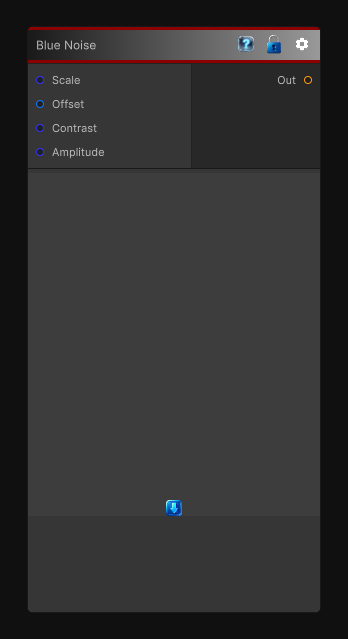

# Blue Noise

> This file is auto-generated by `Documentation/Generate-GenesisNodeDocs.ps1`.

[Back to index](../../README.md) | [Back to Generators](../../generators.md)

## Snapshot

## Details

- Menu: `Generators/Noise/Blue Noise`
- Node group: `Noise`
- Shader: `Hidden/Genesis/BlueNoise`
- Source: [Runtime/Nodes/Generator/Noise/BlueNoise.cs](../../../../Runtime/Nodes/Generator/Noise/BlueNoise.cs)

## Documentation

The BlueNoise node generates a high-quality, tile-free, spatially uniform blue-noise mask using a Hilbert-curve R1 quasirandom sequence.
This pattern is ideal for:
- Dithering
- Stochastic sampling
- Procedural scattering
- Pattern breakup
- Anti-aliasing
- Poisson-like distributions
Blue noise avoids clustering and low-frequency artifacts, producing visually pleasing, evenly spaced randomness.
