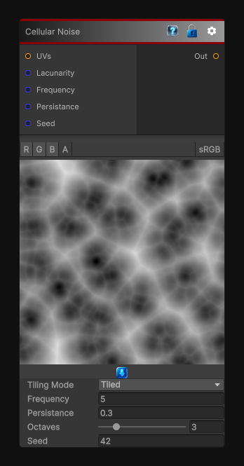

# Cellular Noise

> This file is auto-generated by `Documentation/Generate-GenesisNodeDocs.ps1`.

[Back to index](../../README.md) | [Back to Generators](../../generators.md)

## Snapshot

## Details

- Menu: `Generators/Noise/Cellular Noise`
- Node group: `Noise`
- Shader: `Hidden/Genesis/CellularNoise`
- Source: [Runtime/Nodes/Generator/Noise/CellularNoise.cs](../../../../Runtime/Nodes/Generator/Noise/CellularNoise.cs)

## Documentation

The CellularNoise node generates Worley-style cellular noise in 2D, 3D, or Cube space, with full control over:
- Distance metric
- Cell size
- Octaves (FBM)
- Lacunarity & persistence
- Tiling mode
- Output range
- Multi-channel evaluation (R, RG, RGB, RGBA)
- Multiple cell modes (distance, smooth distance, cells, valleys)
This node is one of the most flexible and powerful procedural building blocks in the Genesis ecosystem, suitable for:
- Stone, rock, and organic textures
- Voronoi patterns
- Cracks, cells, and biological structures
- Stylized noise
- Masks and breakup patterns
- Terrain and material generation
