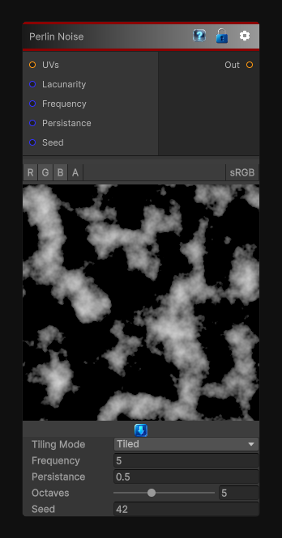

# Perlin Noise

> This file is auto-generated by `Documentation/Generate-GenesisNodeDocs.ps1`.

[Back to index](../../README.md) | [Back to Generators](../../generators.md)

## Snapshot

## Details

- Menu: `Generators/Noise/Perlin Noise`
- Node group: `Noise`
- Shader: `Hidden/Genesis/PerlinNoise`
- Source: [Runtime/Nodes/Generator/Noise/PerlinNoise.cs](../../../../Runtime/Nodes/Generator/Noise/PerlinNoise.cs)

## Documentation

The PerlinNoise node generates 2D or 3D Perlin FBM noise with full control over:
- Frequency
- Octaves
- Persistence
- Lacunarity
- Output range
- Tiling mode
- Multi-channel evaluation (R, RG, RGB, RGBA)
This node is a foundational building block for procedural materials, masks, terrain, clouds, and stylized effects
