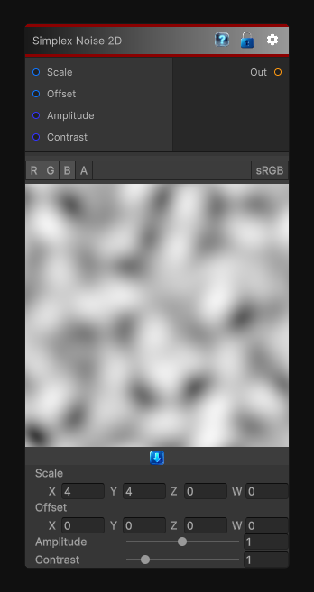

# Simplex Noise 2D

> This file is auto-generated by `Documentation/Generate-GenesisNodeDocs.ps1`.

[Back to index](../../README.md) | [Back to Generators](../../generators.md)

## Snapshot

## Details

- Menu: `Generators/Noise/Simplex 2D`
- Node group: `Noise`
- Shader: `Hidden/Genesis/Simplex2D`
- Source: [Runtime/Nodes/Generator/Noise/Simplex2DNode.cs](../../../../Runtime/Nodes/Generator/Noise/Simplex2DNode.cs)

## Documentation

The Simplex2D node generates 2D simplex noise using a clean, deterministic implementation of Inigo Quilez's classic simplex algorithm.
It is lightweight, fast, and ideal for:
- Organic masks
- Terrain breakup
- Cloud and fog layers
- Stylized materials
- Distortion fields
- Procedural animation
- Noise-driven effects
This node outputs a single-channel scalar noise value, with amplitude and contrast shaping for artistic control.
