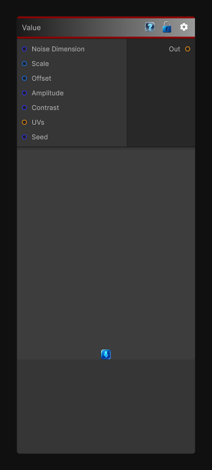

# Value

> This file is auto-generated by `Documentation/Generate-GenesisNodeDocs.ps1`.

[Back to index](../../README.md) | [Back to Generators](../../generators.md)

## Snapshot

## Details

- Menu: `Generators/Noise/Value`
- Node group: `Noise`
- Shader: `Hidden/Genesis/ValueNoise_2D3D4D`
- Source: [Runtime/Nodes/Generator/Noise/ValueNode.cs](../../../../Runtime/Nodes/Generator/Noise/ValueNode.cs)

## Documentation

The ValueNoise (2D / 3D / 4D) node generates deterministic, sampler-free value noise in 2D, 3D, or 4D space.
It uses hash-based corner values and smooth interpolation to produce:
- Soft gradients
- Organic patterns
- Procedural masks
- Stylized materials
- Distortion fields
- Volumetric noise (3D)
- Animated 4D noise (time as W)
This node is ideal when you need predictable, tile-free, dimension-independent noise without the complexity of Perlin or Simplex.
