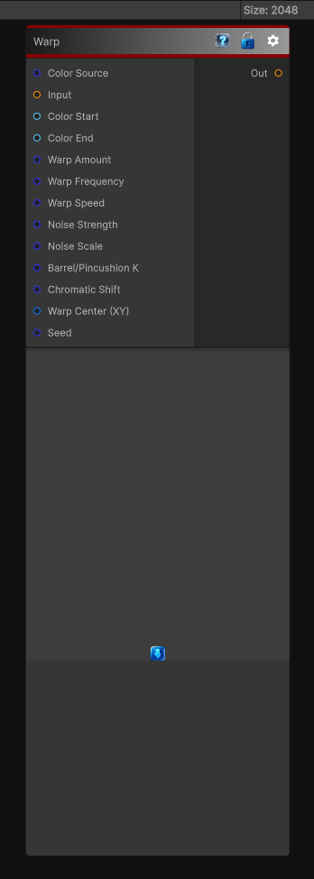

# Warp

> This file is auto-generated by `Documentation/Generate-GenesisNodeDocs.ps1`.

[Back to index](../../README.md) | [Back to Generators](../../generators.md)

## Snapshot

## Details

- Menu: `Generators/Noise/Warp Noise`
- Aliases: `Effects/Warp Noise`
- Node group: `Noise`
- Shader: `Hidden/Genesis/WarpNoise`
- Source: [Runtime/Nodes/Generator/Noise/WarpNoise.cs](../../../../Runtime/Nodes/Generator/Noise/WarpNoise.cs)

## Documentation

The WarpNoise node performs procedural UV warping, chromatic aberration, and optional color generation using a combination of:
- Directional sine warping
- FBM turbulence
- Barrel/pincushion distortion
- Chromatic shift
- Input-based or procedurally generated color
This node is ideal for:
- Stylized distortion effects
- Glitch and hologram shaders
- Psychedelic or vaporwave looks
- Heat haze and underwater distortion
- Magical FX
- Animated noise-driven warping
- Chromatic aberration overlays
It can operate in two modes:
- Input Mode - warps an input texture
- Generated Mode - generates color procedurally using a color gradient
