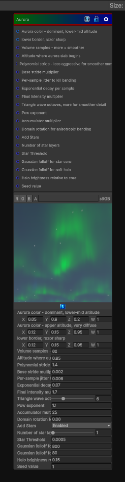

# Aurora

> This file is auto-generated by `Documentation/Generate-GenesisNodeDocs.ps1`.

[Back to index](../../README.md) | [Back to Generators](../../generators.md)

## Snapshot

## Details

- Menu: `Generators/Other/Aurora`
- Node group: `Other`
- Shader: `Hidden/Genesis/Aurora`
- Source: [Runtime/Nodes/Generator/Pattern/AuroraNode.cs](../../../../Runtime/Nodes/Generator/Pattern/AuroraNode.cs)

## Documentation

Simulates an Aurora
