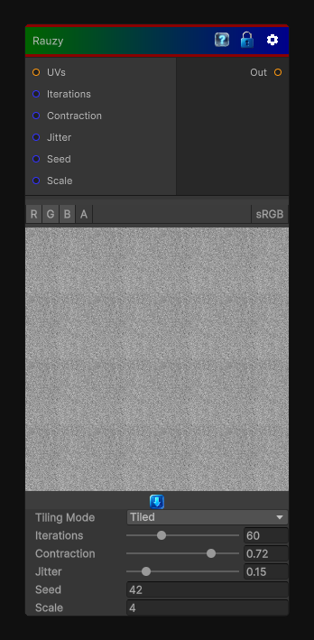

# Rauzy

> This file is auto-generated by `Documentation/Generate-GenesisNodeDocs.ps1`.

[Back to index](../../README.md) | [Back to Generators](../../generators.md)

## Snapshot

## Details

- Menu: `Generators/Other/Rauzy`
- Node group: `Other`
- Shader: `Hidden/Genesis/RauzyFractal`
- Source: [Runtime/Nodes/Generator/RauzyNode.cs](../../../../Runtime/Nodes/Generator/RauzyNode.cs)

## Documentation

The Rauzy fractal is one of the most beautiful substitution-system fractals, but unlike Mandelbrot/Julia, it's not defined by complex iteration. It comes from:
- A substitution morphism on a symbolic sequence
- Projecting the symbolic orbit into \mathbb{R^{\mathnormal{2}}}
- Taking the closure of the resulting point set
