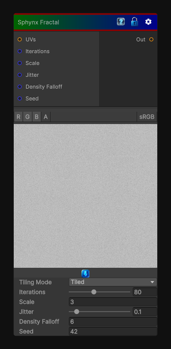

# Sphynx Fractal

> This file is auto-generated by `Documentation/Generate-GenesisNodeDocs.ps1`.

[Back to index](../../README.md) | [Back to Generators](../../generators.md)

## Snapshot

## Details

- Menu: `Generators/Other/Spynx Fractal`
- Node group: `Other`
- Shader: `Hidden/Genesis/SphynxFractal`
- Source: [Runtime/Nodes/Generator/SpynxFractalNode.cs](../../../../Runtime/Nodes/Generator/SpynxFractalNode.cs)

## Documentation

Generates a Spynx Fractal, a fractal that is created by repeatedly applying a transformation to a point in the complex plane. The transformation is defined by the equation z = z^2 + c, where z is a complex number and c is a constant. The resulting pattern is self-similar and has a fractal dimension of 2.
