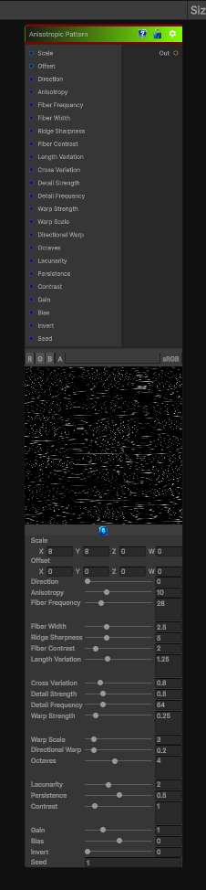

# Anisotropic Pattern

> This file is auto-generated by `Documentation/Generate-GenesisNodeDocs.ps1`.

[Back to index](../../README.md) | [Back to Generators](../../generators.md)

## Snapshot

## Details

- Menu: `Generators/Pattern/Anisotropic Noise 1`
- Node group: `Pattern`
- Shader: `Hidden/Genesis/AnisotropicNoise`
- Source: [Runtime/Nodes/Generator/Pattern/AnisotropicNode1.cs](../../../../Runtime/Nodes/Generator/Pattern/AnisotropicNode1.cs)

## Documentation

A compact Genesis CRT node that generates anisotropic procedural noise suitable for streaks, brushed surfaces, wood grain, and directional fabric. It produces a single grayscale output where brighter values represent higher noise intensity. The node is deterministic, CRT-friendly, and designed to be used as a texture source inside Genesis graphs or as a mask/height input for material blending.
