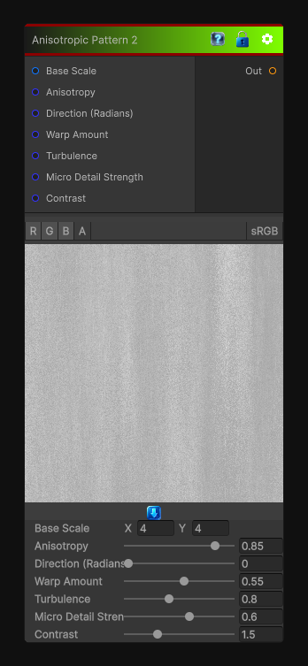

# Anisotropic Pattern 2

> This file is auto-generated by `Documentation/Generate-GenesisNodeDocs.ps1`.

[Back to index](../../README.md) | [Back to Generators](../../generators.md)

## Snapshot

## Details

- Menu: `Generators/Pattern/Anisotropic Noise 2`
- Node group: `Pattern`
- Shader: `Hidden/Genesis/AnisotropicNoise2`
- Source: [Runtime/Nodes/Generator/Pattern/AnisotropicNode2.cs](../../../../Runtime/Nodes/Generator/Pattern/AnisotropicNode2.cs)

## Documentation

streaks + turbulence + cross-flow, closer to a noisy brushed metal / fibrous chaos.
