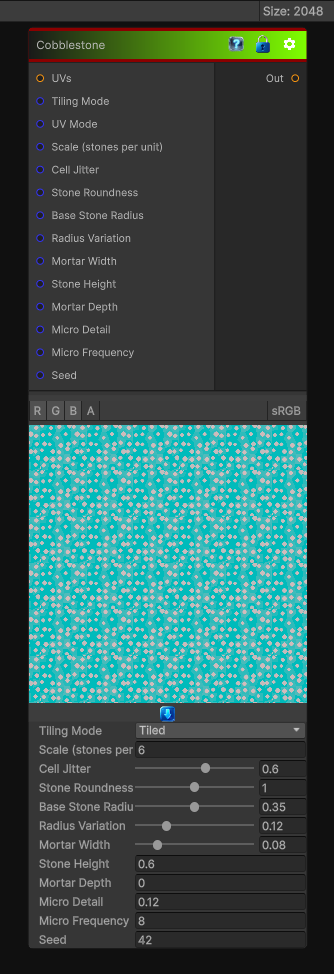

# Cobblestone

> This file is auto-generated by `Documentation/Generate-GenesisNodeDocs.ps1`.

[Back to index](../../README.md) | [Back to Generators](../../generators.md)

## Snapshot

## Details

- Menu: `Generators/Pattern/Cobblestone`
- Node group: `Pattern`
- Shader: `Hidden/Genesis/Cobblestone`
- Source: [Runtime/Nodes/Generator/Pattern/CobblestoneNode.cs](../../../../Runtime/Nodes/Generator/Pattern/CobblestoneNode.cs)

## Documentation

Generates a cobblestone pattern, which is a type of pattern that consists of irregularly shaped stones that are arranged in a random manner. The pattern is often used in architecture and landscaping, and can be generated using a variety of algorithms, such as Perlin noise or Voronoi diagrams.
