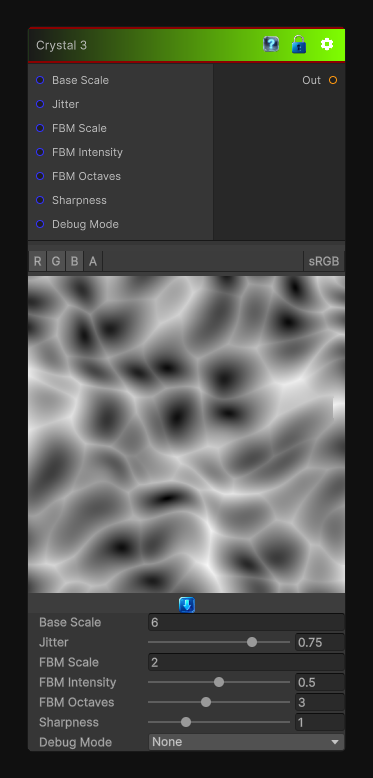

# Crystal 3

> This file is auto-generated by `Documentation/Generate-GenesisNodeDocs.ps1`.

[Back to index](../../README.md) | [Back to Generators](../../generators.md)

## Snapshot

## Details

- Menu: `Generators/Pattern/Crystal 3`
- Node group: `Pattern`
- Shader: `Hidden/Genesis/Crystal3`
- Source: [Runtime/Nodes/Generator/Pattern/Crystal3Node.cs](../../../../Runtime/Nodes/Generator/Pattern/Crystal3Node.cs)

## Documentation

Crystal 3 is less about hard mineral edges and more about:
- Rounded crystalline blobs
- Soft transitions
- Organic mineral deposits
- Clay-like cellular breakup
- Smooth Worley-derived gradients
