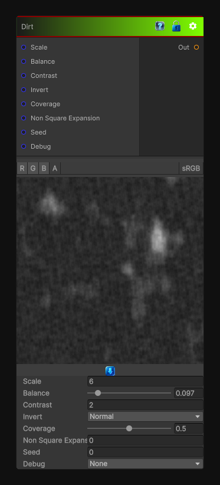

# Dirt

> This file is auto-generated by `Documentation/Generate-GenesisNodeDocs.ps1`.

[Back to index](../../README.md) | [Back to Generators](../../generators.md)

## Snapshot

## Details

- Menu: `Generators/Pattern/Dirt 1`
- Node group: `Pattern`
- Shader: `Hidden/Genesis/GrungeDirt`
- Source: [Runtime/Nodes/Generator/Pattern/DirtNode.cs](../../../../Runtime/Nodes/Generator/Pattern/DirtNode.cs)

## Documentation

Generates a dirt-style grunge pattern for surface breakup, masking, and worn material detail.
