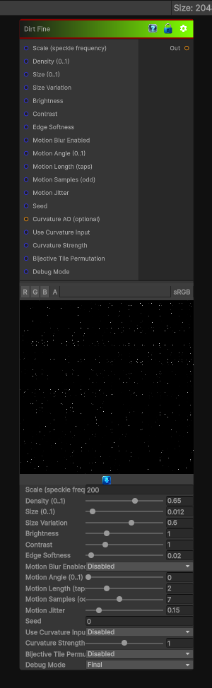

# Dirt Fine

> This file is auto-generated by `Documentation/Generate-GenesisNodeDocs.ps1`.

[Back to index](../../README.md) | [Back to Generators](../../generators.md)

## Snapshot

## Details

- Menu: `Generators/Pattern/Dirt Fine`
- Node group: `Pattern`
- Shader: `Hidden/Genesis/GrungeDirtFine`
- Source: [Runtime/Nodes/Generator/Pattern/DirtFineNode.cs](../../../../Runtime/Nodes/Generator/Pattern/DirtFineNode.cs)

## Documentation

Generates a finer dirt pattern for subtle grime, dust, and high-frequency surface breakup.
