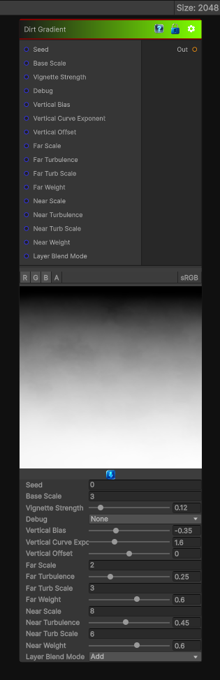

# Dirt Gradient

> This file is auto-generated by `Documentation/Generate-GenesisNodeDocs.ps1`.

[Back to index](../../README.md) | [Back to Generators](../../generators.md)

## Snapshot

## Details

- Menu: `Generators/Pattern/Dirt Gradient`
- Node group: `Pattern`
- Shader: `Hidden/Genesis/DirtGradient`
- Source: [Runtime/Nodes/Generator/Pattern/DirtGradientNode.cs](../../../../Runtime/Nodes/Generator/Pattern/DirtGradientNode.cs)

## Documentation

A Genesis Noise shader node that produces a vertical dirt gradient (dark at top -> light at bottom) blended with procedural dirt: multi-scale FBM, speckle, splatter, domain warp, curvature/AO bias, and debug outputs. The gradient is controllable (curve, falloff, invert) and tile-safe for CRT render textures.
