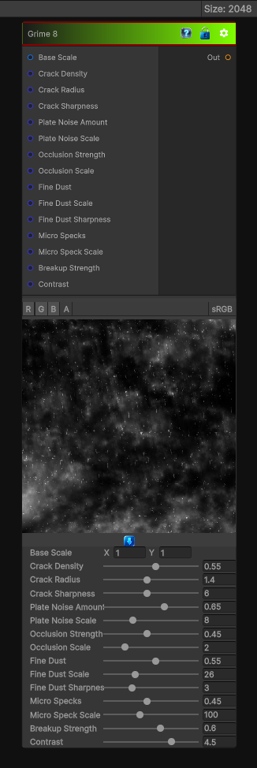

# Grime 8

> This file is auto-generated by `Documentation/Generate-GenesisNodeDocs.ps1`.

[Back to index](../../README.md) | [Back to Generators](../../generators.md)

## Snapshot

## Details

- Menu: `Generators/Pattern/Grime 8`
- Node group: `Pattern`
- Shader: `Hidden/Genesis/Grunge008`
- Source: [Runtime/Nodes/Generator/Pattern/Grime8Node.cs](../../../../Runtime/Nodes/Generator/Pattern/Grime8Node.cs)

## Documentation

Generates an eighth grime pattern variant for dense dirt accumulation and surface wear.
