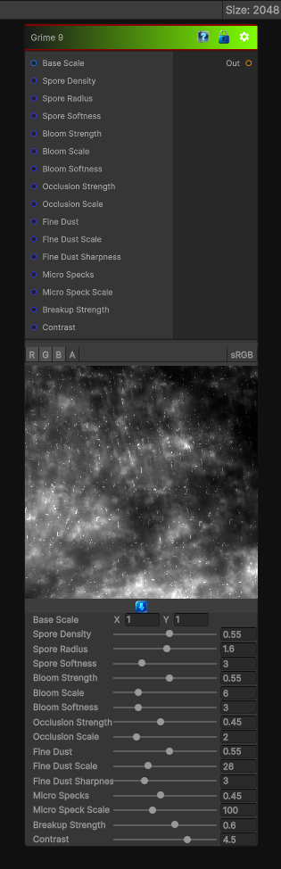

# Grime 9

> This file is auto-generated by `Documentation/Generate-GenesisNodeDocs.ps1`.

[Back to index](../../README.md) | [Back to Generators](../../generators.md)

## Snapshot

## Details

- Menu: `Generators/Pattern/Grime 9`
- Node group: `Pattern`
- Shader: `Hidden/Genesis/Grunge009`
- Source: [Runtime/Nodes/Generator/Pattern/Grime9Node.cs](../../../../Runtime/Nodes/Generator/Pattern/Grime9Node.cs)

## Documentation

Generates a ninth grime pattern variant for layered dirty masks and worn material detail.
