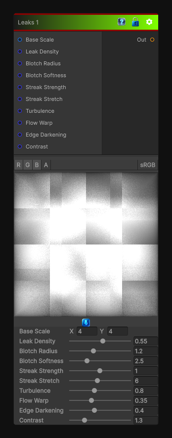

# Leaks 1

> This file is auto-generated by `Documentation/Generate-GenesisNodeDocs.ps1`.

[Back to index](../../README.md) | [Back to Generators](../../generators.md)

## Snapshot

## Details

- Menu: `Generators/Pattern/Leaks 1`
- Node group: `Pattern`
- Shader: `Hidden/Genesis/GrungeLeaks1`
- Source: [Runtime/Nodes/Generator/Pattern/LeaksNode.cs](../../../../Runtime/Nodes/Generator/Pattern/LeaksNode.cs)

## Documentation

- Leak origins
Large Gaussian blotches where leaks begin.
- Vertical streaking
Directional drips that feel like gravity-pulled grime.
- Turbulent breakup
Irregular, dirty, organic edges.
- Flow drift
Soft downward motion like wet grime.
