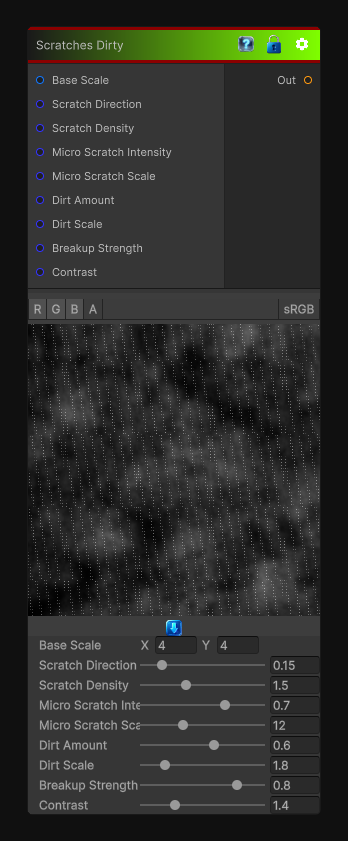

# Scratches Dirty

> This file is auto-generated by `Documentation/Generate-GenesisNodeDocs.ps1`.

[Back to index](../../README.md) | [Back to Generators](../../generators.md)

## Snapshot

## Details

- Menu: `Generators/Pattern/Scratches Dirty`
- Node group: `Pattern`
- Shader: `Hidden/Genesis/GrungeScratchesDirty`
- Source: [Runtime/Nodes/Generator/Pattern/ScratchesDirtyNode.cs](../../../../Runtime/Nodes/Generator/Pattern/ScratchesDirtyNode.cs)

## Documentation

- Long directional scratches
- Chaotic micro-scratches
- Dirt buildup in recesses
- Multi-scale breakup
- High-contrast "dirty" shaping
- Fully procedural, no textures
