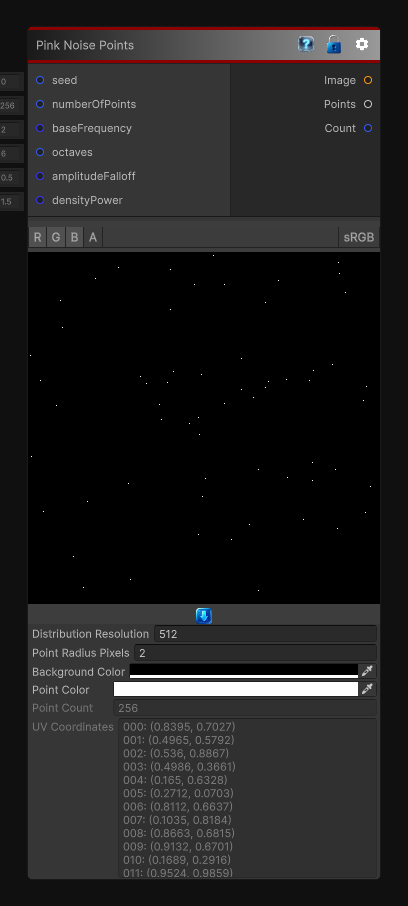

# Pink Noise Points

> This file is auto-generated by `Documentation/Generate-GenesisNodeDocs.ps1`.

[Back to index](../../README.md) | [Back to Generators](../../generators.md)

## Snapshot

## Details

- Menu: `Generators/Points/Pink Noise Points`
- Node group: `Noise`
- Source: [Runtime/Nodes/Generator/Noise/PinkNoisePointsNode.cs](../../../../Runtime/Nodes/Generator/Noise/PinkNoisePointsNode.cs)

## Documentation

Generates random 2D points from an internally generated pink-noise density field.

Pink noise emphasizes broad, low-frequency variation while retaining some fine detail, so the resulting points form soft clustered regions instead of a uniform scatter. The `Points` output contains normalized UV coordinates in the `[0, 1]` range.
