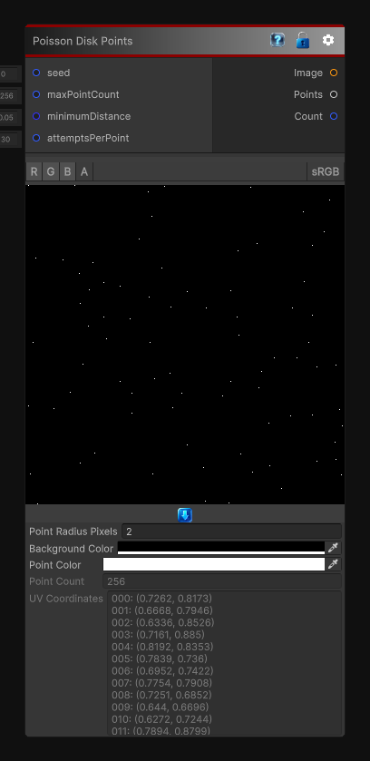

# Poisson Disk Points

> This file is auto-generated by `Documentation/Generate-GenesisNodeDocs.ps1`.

[Back to index](../../README.md) | [Back to Generators](../../generators.md)

## Snapshot

## Details

- Menu: `Generators/Points/Poisson Disk Points`
- Node group: `Noise`
- Source: [Runtime/Nodes/Generator/Noise/PoissonDiskPointsNode.cs](../../../../Runtime/Nodes/Generator/Noise/PoissonDiskPointsNode.cs)

## Documentation

Generates a 2D Poisson disk point set and outputs both a point image and the generated coordinates.

This node uses Bridson-style Poisson disk sampling to keep points evenly spaced while still feeling organic. The `Points` output contains normalized UV coordinates in the `[0, 1]` range.
