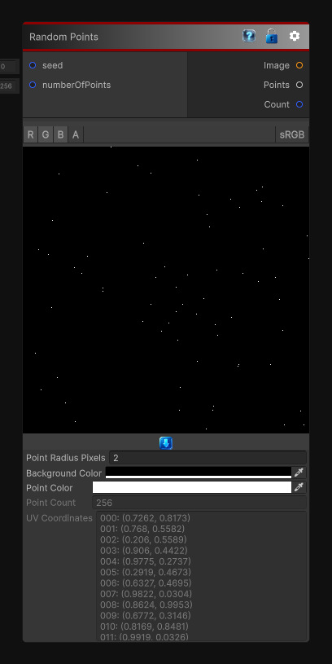

# Random Points

> This file is auto-generated by `Documentation/Generate-GenesisNodeDocs.ps1`.

[Back to index](../../README.md) | [Back to Generators](../../generators.md)

## Snapshot

## Details

- Menu: `Generators/Points/Random Points`
- Node group: `Noise`
- Source: [Runtime/Nodes/Generator/Noise/RandomPointsNode.cs](../../../../Runtime/Nodes/Generator/Noise/RandomPointsNode.cs)

## Documentation

Generates a uniformly random set of 2D points and outputs both a point image and the generated coordinates.

The `Points` output contains normalized UV coordinates in the `[0, 1]` range so it can be reused directly for scattering, sampling, and other procedural workflows.
