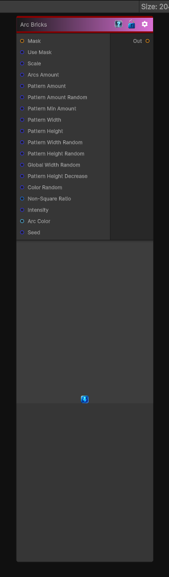

# Arc Bricks

> This file is auto-generated by `Documentation/Generate-GenesisNodeDocs.ps1`.

[Back to index](../../README.md) | [Back to Generators](../../generators.md)

## Snapshot

## Details

- Menu: `Generators/Shapes/Arc Bricks`
- Node group: `Shape`
- Shader: `Hidden/Genesis/ArcPavement`
- Source: [Runtime/Nodes/Generator/Shape/ArcBricksNode.cs](../../../../Runtime/Nodes/Generator/Shape/ArcBricksNode.cs)

## Documentation

Generates concentric arcs, bricks along arcs, per-arc and per-brick randomization, non-square compensation, and a height mask suitable for feeding into your existing Height->Normal, Curvature, etc.
