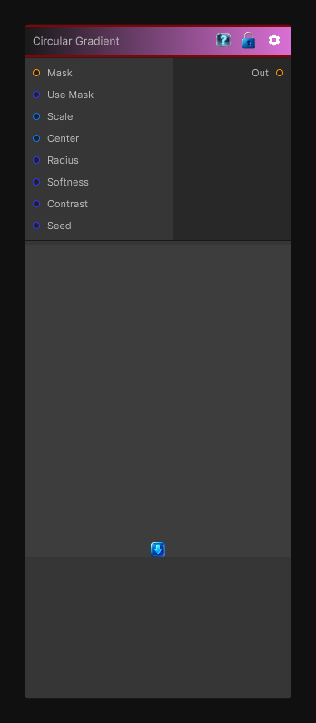

# Circular Gradient

> This file is auto-generated by `Documentation/Generate-GenesisNodeDocs.ps1`.

[Back to index](../../README.md) | [Back to Generators](../../generators.md)

## Snapshot

## Details

- Menu: `Generators/Shapes/Circular Gradient`
- Node group: `Shape`
- Shader: `Hidden/Genesis/GradientCircular`
- Source: [Runtime/Nodes/Generator/Shape/GradientCircularNode.cs](../../../../Runtime/Nodes/Generator/Shape/GradientCircularNode.cs)

## Documentation

- A clean radial gradient (center -> edge)
- Adjustable radius, softness, contrast, center offset, tiling
- Perfect for:
- Shape generation
- Circular masks
- Height maps
- Lens-style falloffs
- Organic blending
- Feeding into Slope Blur, Histogram Scan, Curvature, etc.
