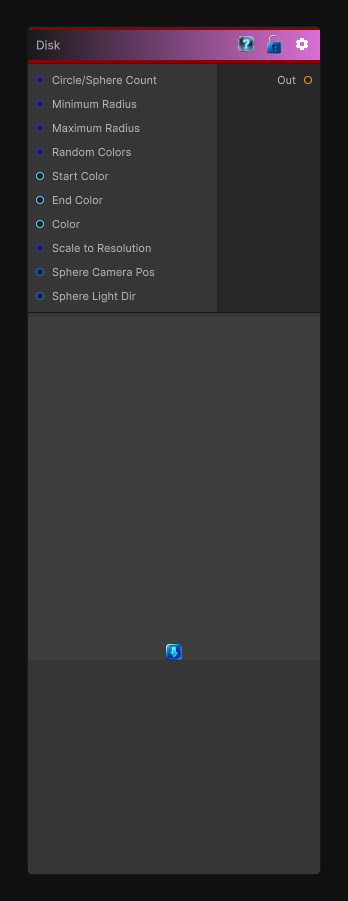

# Disk

> This file is auto-generated by `Documentation/Generate-GenesisNodeDocs.ps1`.

[Back to index](../../README.md) | [Back to Generators](../../generators.md)

## Snapshot

## Details

- Menu: `Generators/Shapes/Disk`
- Aliases: `Generators/Shapes/Sphere`
- Node group: `Shape`
- Shader: `Hidden/Genesis/Circles`
- Source: [Runtime/Nodes/Generator/Shape/CirclesGenerator.cs](../../../../Runtime/Nodes/Generator/Shape/CirclesGenerator.cs)

## Documentation

Generate a Disk, in 3D this node generate a solid spheres.
