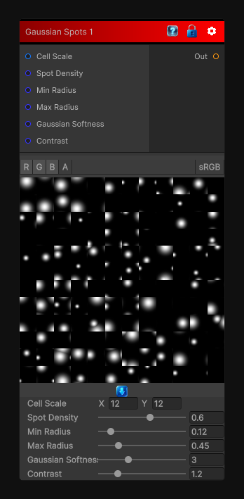

# Gaussian Spots 1

> This file is auto-generated by `Documentation/Generate-GenesisNodeDocs.ps1`.

[Back to index](../../README.md) | [Back to Generators](../../generators.md)

## Snapshot

## Details

- Menu: `Generators/Shapes/Gaussian Spots 1`
- Node group: `Shapes`
- Shader: `Hidden/Genesis/GaussianSpots1`
- Source: [Runtime/Nodes/Generator/Shape/GaussianSpotsNode1.cs](../../../../Runtime/Nodes/Generator/Shape/GaussianSpotsNode1.cs)

## Documentation

- Soft Gaussian blobs
- Smooth photographic falloff
- Random radii per cell
- Overlapping clusters
- Substance-style additive blending
- Perfect for roughness masks, grunge, organic breakup
