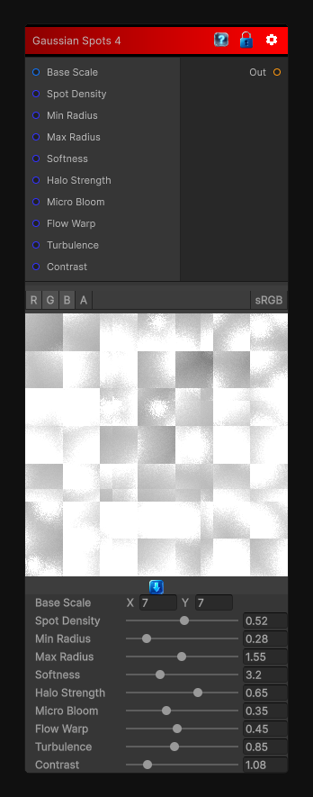

# Gaussian Spots 4

> This file is auto-generated by `Documentation/Generate-GenesisNodeDocs.ps1`.

[Back to index](../../README.md) | [Back to Generators](../../generators.md)

## Snapshot

## Details

- Menu: `Generators/Shapes/Gaussian Spots 4`
- Node group: `Shapes`
- Shader: `Hidden/Genesis/GaussianSpots4`
- Source: [Runtime/Nodes/Generator/Shape/GaussianSpotsNode4.cs](../../../../Runtime/Nodes/Generator/Shape/GaussianSpotsNode4.cs)

## Documentation

- Ink-bloom diffusion
- Soft volumetric halos
- Gentle flow drift
- Turbulent breakup
- Micro-bloom sparkles
- Painterly, atmospheric gradients
It's the most ink-like and diffusive variant so far - perfect for watercolor, stylized shading, roughness breakup, or organic masks.
